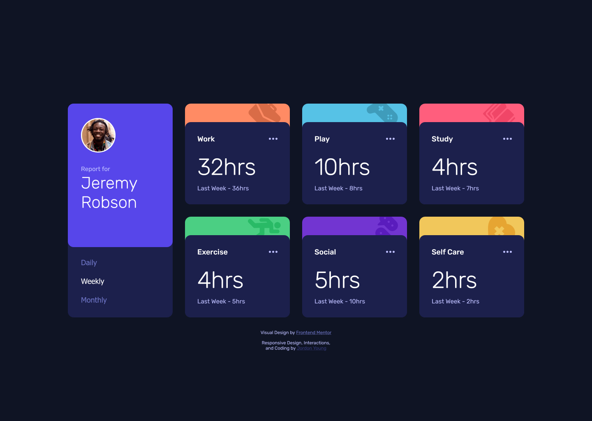
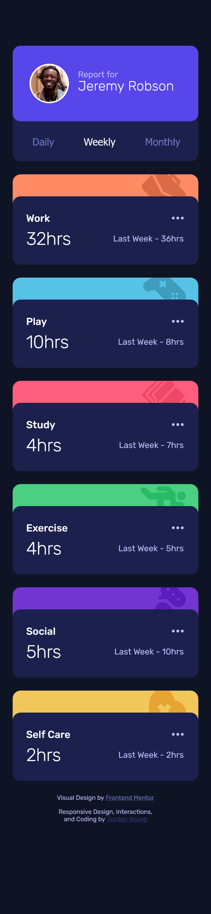
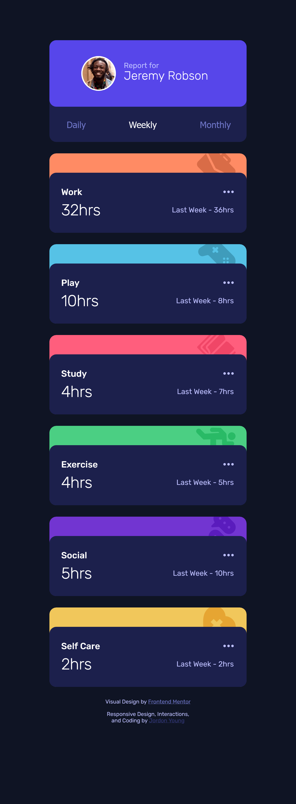
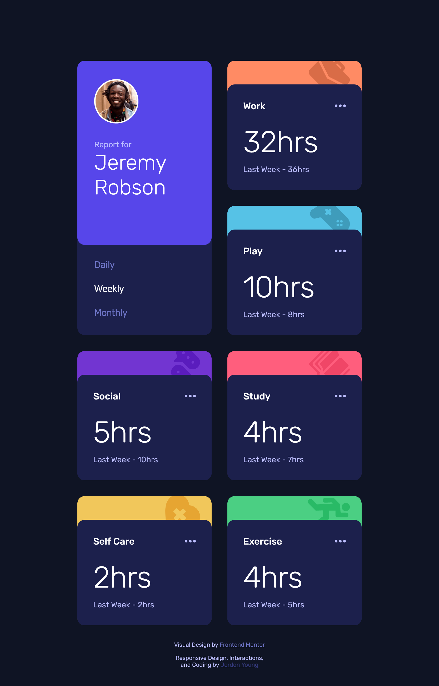

# Activity Tracker :watch::woman_mechanic::soccer::weight_lifting:

This is a solution to the [Time Tracking Dashboard Challenge](https://www.frontendmentor.io/challenges/time-tracking-dashboard-UIQ7167Jw) by [Frontend Mentor](https://www.frontendmentor.io/).

## :book: Table of Contents

[:clipboard: The Challenge](#📋-the-challenge)

[:white_check_mark: The Solution](#✅-the-solution)

[:link: Links](#🔗-links)

## :clipboard: The Challenge

- [Brief](#brief)
- [FEM Provided Resources](#fem-provided-resources)
- [My Goals](#my-goals)

[:arrow_up: Table of Contents](#📖-table-of-contents)

### Brief

From the [Time Tracking Dashboard Challenge](https://www.frontendmentor.io/challenges/time-tracking-dashboard-UIQ7167Jw) page on Frontend Mentor's website:

> Your challenge is to build out this dashboard and get it looking as close to the design as possible.
>
> You can use any tools you like to help you complete the challenge. So if you've got something you'd like to practice, feel free to give it a go.
>
> If you would like to practice working with JSON data, we provide a local data.json file for the activities. This means you'll be able to pull the data from there instead of using the content in the .html file.
>
> Your users should be able to:
>
> - View the optimal layout for the site depending on their device's screen size
> - See hover states for all interactive elements on the page
> - Switch between viewing Daily, Weekly, and Monthly stats

### FEM Provided Resources

- Starting File Structure
- Minimalistic [Style Guide](./assets/design/style-guide.md)
- Images Included in Design
- [Design Screenshots](./assets/design/) (Desktop, Active States, Mobile)

### My Goals

- Responsively Transition from Mobile to Desktop
- Use Mobile First Media Queries
- Read Data from JSON
- Improve UX with Interactions and Transitions

## :white_check_mark: The Solution

- [Original Design vs. Solution](#original-design-vs-solution)
- [Additional Solution Layouts](#additional-solution-layouts)

[:arrow_up: Table of Contents](#📖-table-of-contents)

### Original Design vs. Solution

<table>
  <thead>
    <tr align="middle">
      <td>Breakpoint</td>
      <td>Original</td>
      <td>Solution</td>
    </tr>
  </thead>
  <tbody>
    <tr>
      <td>Desktop</td>
      <td>
        
      </td>
      <td>
        
      </td>
    </tr>
    <tr>
      <td>Mobile</td>
      <td valign="top">
        
      </td>
      <td>
        
      </td>
    </tr>
  </tbody>
</table>

### Additional Solution Layouts

|  Breakpoint  |                                             Layout                                              |
| :----------: | :---------------------------------------------------------------------------------------------: |
| Mobile Wide  |                                    |
|  Two Column  |  |
| Three Column |         |

## :link: Links

[:arrow_up: Table of Contents](#📖-table-of-contents)

### Author

- Github Profile - [Jordon Young](https://github.com/jordon-young/)
- Frontend Mentor - [@jordon-young](https://www.frontendmentor.io/profile/jordon-young)

### Project

- [Github Repository (Public)](https://github.com/jordon-young/fem-activity-tracker)
- [Solution Live Site](https://jordon-young.github.io/fem-activity-tracker/)
